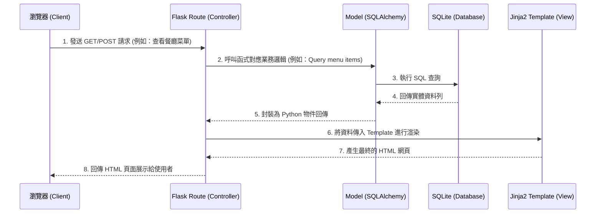

# 系統架構設計 (Architecture) - 校園訂餐系統

基於 PRD（產品需求文件）中的要求，本專案將採用輕量且易於擴展的 Python Web 後端技術棧，搭配傳統的伺服器渲染網頁，以最小可行性產品（MVP）為目標進行設計。

## 1. 技術架構說明

本系統沒有採用複雜的前後端分離架構，而是讓後端直接處理資料並整合樣板（Template）來回傳完整的 HTML 網頁。

### 選用技術與原因
- **後端框架：Python + Flask**
  - **原因**：Flask 是輕量級的微框架，具有高度彈性。對於像校園訂餐這類流程直接、規模適中的 MVP，Flask 能快速建立 API 與路由，並且學習曲線平緩。
- **模板引擎：Jinja2**
  - **原因**：Flask 內建支援 Jinja2，可以方便地將從資料庫抓取出來的餐點、訂單資料，動態渲染成 HTML 頁面結構。
- **資料庫：SQLite (搭配 SQLAlchemy ORM)**
  - **原因**：SQLite 不需另外架設獨立的資料庫伺服器，資料直接存儲在本地檔案中，非常適合初期的開發、測試與小規模部署；而透過 SQLAlchemy 能讓我們用 Python 語法操作資料庫，避免寫死 SQL 字串。

### Flask MVC 模式說明
雖然 Flask 本身沒有強制的架構規範，但我們將依循經典的 **MVC (Model-View-Controller)** 模式來維持專案整潔：
- **Model (模型)**：負責定義資料表結構（如用戶、菜單、訂單）與操作業務邏輯，直接與 SQLite 資料庫互動。
- **View (視圖)**：Jinja2 模板與靜態檔案（HTML / CSS / JS），負責把使用者的畫面呈現出來。
- **Controller (控制器)**：在 Flask 裡被稱為 Route (路由) 加上 View Function。負責接收瀏覽器的請求、向 Model 拿取相對應的資料，最後把資料傳給 View 來產生網頁。

---

## 2. 專案資料夾結構

因應功能需求，我們將採用功能與職責明確的資料夾結構（Application Factory 模式精神）：

```text
web_app_development/
├── docs/               ← 存放專案說明文件（包含本架構文件與 PRD）
├── instance/           
│   └── database.db     ← SQLite 本地資料庫檔案（需加入 gitignore）
├── app/                ← 核心應用程式包
│   ├── __init__.py     ← 初始化 Flask App 與 資料庫連線
│   ├── models/         ← (Model) 資料庫結構與互動邏輯
│   │   ├── __init__.py
│   │   ├── user.py     ← 學生、店家使用者模型
│   │   ├── menu.py     ← 餐廳與菜單模型
│   │   └── order.py    ← 購物車與訂單模型
│   ├── routes/         ← (Controller) 接收請求並處理商業邏輯
│   │   ├── __init__.py
│   │   ├── auth.py     ← 註冊、登入與登出邏輯
│   │   ├── student.py  ← 學生瀏覽、購物車與下單邏輯
│   │   └── shop.py     ← 店家菜單管理與接收訂單邏輯
│   ├── templates/      ← (View) Jinja2 HTML 樣板
│   │   ├── base.html   ← 共用的 HTML 骨架（含導覽列）
│   │   ├── auth/       ← 登入、註冊相關頁面
│   │   ├── student/    ← 學生端頁面（菜單列表、購物車、查詢訂單）
│   │   └── shop/       ← 店家端頁面（接收訂單面板）
│   └── static/         ← (View) 靜態資源
│       ├── css/        ← 自訂或框架的 CSS 樣式
│       ├── js/         ← 前端互動邏輯
│       └── images/     ← 圖片素材（如餐廳 Logo 或餐點圖）
├── app.py              ← 專案的啟動入口腳本
├── requirements.txt    ← Python 依賴套件清單
└── README.md           ← 專案簡介與快速啟動說明
```

---

## 3. 元件關係圖

以下展示了從使用者端（瀏覽器）發送請求，到後端取得資料並回傳頁面的完整流程。



---

## 4. 關鍵設計決策

1. **採用藍圖 (Blueprints) 拆分路由**  
   雖然是初期專案，但一次寫在 `app.py` 裡會造成後續難以維護。因此我們採用 Flask Blueprints，將路由拆分為 `auth.py`（權限）、`student.py`（學生功能）與 `shop.py`（店家功能），能讓分工更明確，減少程式碼衝突。

2. **Session Based Auth (基於 Session 的驗證)**  
   由於沒有做前後端分離，我們直接使用 Flask 內建的 Session 機制來管理使用者的登入狀態，比起 JWT 這樣能減少前台 JavaScript 原生處理 Token 的負擔，並提昇開發速度。針對「學生」跟「店家」身份，會在 Session 裡加上 `role` 的註記來控制不同介面的檢視權限。

3. **統一但具彈性的基礎模板 (base.html)**  
   所有的網頁介面都會繼承自 `base.html`，導覽列（Navbar）會依據當前的 Session `role` 自行判斷顯示：若是學生登入，則顯示「我的購物車/訂單紀錄」；若是店家登入，則顯示「訂單管理面板」。

4. **購物車本地化管理與資料同步策略**  
   購物車功能由於在送出前提下異動極大，為了減少伺服器不必要的 DB I/O，可以結合前端儲存（Session Storage 或 Local Storage），或是存在 Flask Session 當中；只有當學生確認「結帳/送出訂單」時，才正式寫入資料庫的訂單表（Order Tables）中。
