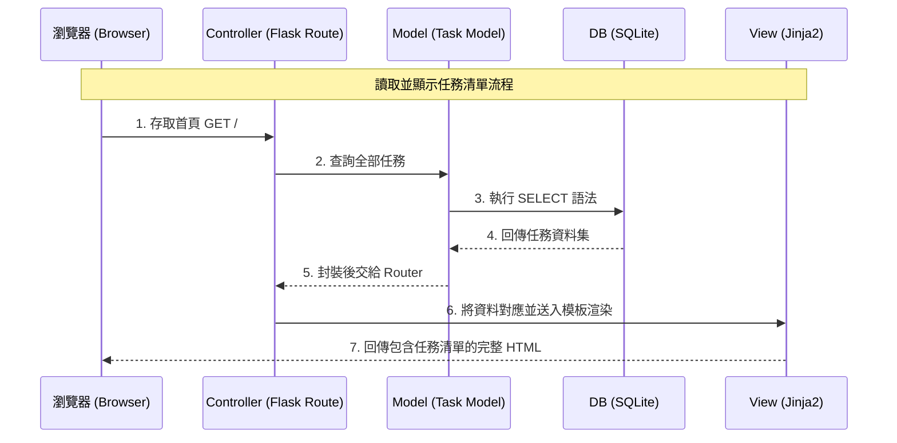

# 系統架構設計 (ARCHITECTURE) - 任務管理系統

## 1. 技術架構說明
本專案採用伺服器端渲染 (Server-Side Rendering, SSR) 模型，而非前後端分離。透過 Python Flask 作為 Web 伺服器與路由框架，結合 Jinja2 作為 HTML 模板渲染引擎，並使用 SQLite 做為輕量的儲存方案。

- **選用技術與原因**：
  - **Flask**：極為輕量且彈性高的 Web 框架，不需要安裝龐大的依賴即可運行，非常適合小型專案或快速開發 MVP。
  - **Jinja2**：Flask 內建深入整合的模板引擎。具備良好的繼承機制與自動跳脫 (Auto-escaping) 功能，能夠簡潔地將後端資料注入 HTML，同時防止 XSS 攻擊。
  - **SQLite**：直接將資料庫儲存為一個檔案，完全省去環境配置或服務啟用的負擔，適合個人任務管理等低併發、讀寫量不大的屬性。
- **MVC 模式說明**：
  - **Model (模型)**：負責定義任務 (Task) 的欄位屬性，與資料庫互動（也就是執行 SQL 查詢寫入與讀取內容的邏輯都封裝於此）。
  - **View (視圖)**：視覺呈現的部分由 `static/` 下的 CSS/JS，以及 `templates/` 下的 HTML 組成，負責向用戶呈現美觀且直覺的使用介面。
  - **Controller (控制器)**：由 `routes/` 裡的 Flask 路由函式負責扮演控制器。它處理包含 GET (讀取頁面)、POST (新增、刪除、完整任務這類資料改變動作)，向 Model 下達命令並在成功後決定回應哪一個 View (Jinja2) 給使用者。

## 2. 專案資料夾結構
為了保持專案的可維護性，這份目錄結構將採用直覺的模組化分割。

```text
web_app_development/
├── app/                      ← 應用程式的主要程式區塊
│   ├── __init__.py           ← 初始化建立 Flask 實體的工廠函數以及 Blueprint 註冊
│   ├── models/               ← (M) 資料庫模型層
│   │   ├── __init__.py
│   │   └── task.py           ← Task 的資料處理與資料庫連線操作 (CURD)
│   ├── routes/               ← (C) 控制器 / 路由層
│   │   ├── __init__.py
│   │   └── task_routes.py    ← 處理所有任務相關網址 (如 / tasks/add )
│   ├── templates/            ← (V) 視圖層 - Jinja2 HTML 模板
│   │   ├── base.html         ← 共同版型 (可包含全局 CSS 引入與共用結構)
│   │   └── index.html        ← 顯示任務清單的首頁
│   └── static/               ← 前端靜態資源
│       ├── css/
│       │   └── style.css     ← 自定義的專案 CSS，負責達成精緻的視覺感
│       └── js/
│           └── script.js     ← 可選：微小的動態互動處理
├── instance/                 ← 運行時動態生成，用以確保安全不被版控同步
│   └── database.db           ← 生成的 SQLite 資料庫檔案
├── docs/                     ← 文件存放目錄
│   ├── PRD.md                ← 產品需求文件
│   └── ARCHITECTURE.md       ← 系統架構文件 (本文)
├── app.py                    ← 啟動專案的入口點 (Entry point)
└── requirements.txt          ← Python 依賴包 (如 flask, gunicorn)
```

## 3. 元件關係圖

以下展示最核心的工作流程 —— 從使用者瀏覽器請求顯示待辦清單，一路到資料庫回傳重新繪製頁面的流程。



若使用者在此頁面點選「新增任務」時，流程如下：
1. 瀏覽器發出 **POST** 請求到新增的路由節點。
2. Controller 接收參數，通知 Model 對 DB 寫入一筆資料。
3. 寫入完畢後，Controller 回傳 HTTP 302 並發動 **Redirect (重定向)** 導回首頁。
4. 瀏覽器再次發起前面展示的讀取流程。

## 4. 關鍵設計決策

1. **路由獨立切割 (Blueprints 模式)**
   - **決策與原因**：雖然這是一個 MVP 小型系統，但我們刻意把路由抽離成 `app/routes/` 裡的檔案並利用 Flask Blueprint 登錄組合。這樣能避免所有路由擠在檔案裡，若未來要加入使用者登入模組 (User) 時，擴充會非常迅速且清楚。
2. **建立共用版型 (Base Template)**
   - **決策與原因**：設定 `templates/base.html` 並在其中放上所有網頁共同需要的 `<head>`，把內文留作 Block 給子頁面（例如 `index.html`）填寫。未來若有需要擴充如「設定頁籤」，畫面便會確保有一致性和低重複度的原始碼。
3. **資料庫連線策略**
   - **決策與原因**：考量到 SQLite 是單機本地存取，我們直接在專案加入參數化指令 (採用 sqlite3)。比起引入大型 ORM，輕巧且沒有進入門檻是考量重點，參數化查詢同時確保了高水準的防範 SQL 注入資訊安全考量。
4. **CSS 採 Vanilla CSS 優先**
   - **決策與原因**：不用額外學習編譯與組建的複雜前端框架，我們可以保持靜態檔案的乾淨單獨，並著重在流暢簡潔的視覺體驗（例如加上微動畫），確保產品質感不會因為技術框架簡化而打折。
