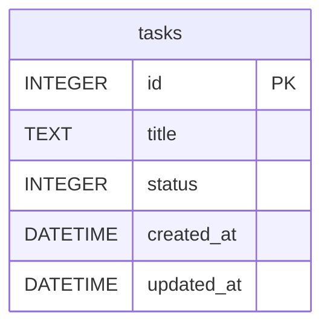

# 資料庫設計 (DB Design) - 任務管理系統

## 1. ER 圖 (實體關係圖)
目前的系統為初階的 MVP 階段，主要只有任務 (`tasks`) 的資料表。

## 2. 資料表詳細說明

### `tasks` 待辦任務表
儲存系統中所有的待辦動作與任務。
- `id` (INTEGER PRIMARY KEY AUTOINCREMENT): 主鍵，作為識別各個任務的唯一值。自動遞增。
- `title` (TEXT): 任務名稱與標題。此欄位必填 (NOT NULL) 且不能為空白。
- `status` (INTEGER): 任務完成狀態。`0` 代表未完成/待辦；`1` 代表已完成。必定要給值 (NOT NULL)，預設為 `0`。
- `created_at` (DATETIME): 任務建立時間。採用 SQLite 預設 `CURRENT_TIMESTAMP` 值。
- `updated_at` (DATETIME): 任務修改時間。新建時與建立時間相同，在後續有修改或完成狀態異動時可做對應更新。

## 3. SQL 建表語法
對應建立 Schema 的 SQL 檔案位於 `database/schema.sql` 之中。

## 4. Python Model 程式碼
根據 架構設計文件 的決定，專案直接透過 `sqlite3` 操作 SQLite 資料庫，避免初期導入重量級的 ORM。
所有 `CRUD (Create, Read, Update, Delete)` 操作已進行封裝並具備妥善的 **SQL Injection** 防護機制。

Model 程式碼位於: `app/models/task.py`
