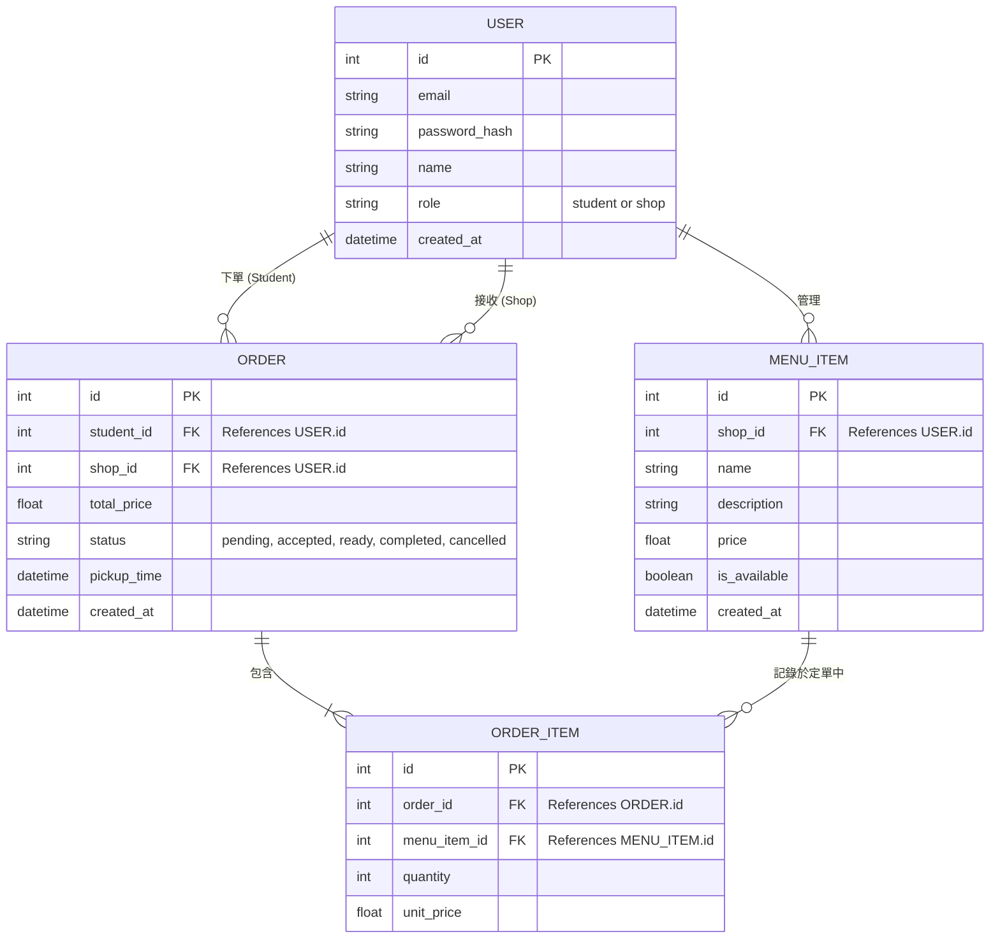

# 資料庫設計 (DB Design) - 校園訂餐系統

## 1. ER 圖（實體關係圖）

## 2. 資料表詳細說明

### 2.1. USER (使用者資料表)
整合存放學生與餐廳店家資訊，利用 `role` 欄位區分。
- **id**: 主鍵 (INTEGER AUTIOINCREMENT)
- **email**: 登入帳號 (TEXT, UNIQUE, 必填)
- **password_hash**: 密碼雜湊 (TEXT, 必填)
- **name**: 學生姓名或店家名稱 (TEXT, 必填)
- **role**: 權限角色 (TEXT, 預設 'student', 只能是 'student' 或 'shop')
- **created_at**: 註冊時間 (DATETIME, 預設當下)

### 2.2. MENU_ITEM (餐廳菜單)
由店家角色建立的餐點。
- **id**: 主鍵
- **shop_id**: 外鍵，對應 `USER.id` (必須屬於一個 role='shop' 的 user)
- **name**: 餐點名字 (TEXT, 必填)
- **description**: 餐點描述 (TEXT)
- **price**: 金額 (REAL, 必填)
- **is_available**: 是否可供應 (BOOLEAN, 預設 TRUE)
- **created_at**: 建立時間

### 2.3. ORDER (訂單紀錄)
- **id**: 主鍵
- **student_id**: 點餐的學生外鍵的 `USER.id`
- **shop_id**: 接單的店家外鍵對應 `USER.id`
- **total_price**: 整筆訂單加總金額 (REAL)
- **status**: 訂單狀態 (TEXT, 包含：'pending', 'accepted', 'ready', 'completed', 'cancelled')
- **pickup_time**: 預計取餐時間 (DATETIME)
- **created_at**: 訂單建立時間 (DATETIME)

### 2.4. ORDER_ITEM (訂單餐點細項)
記錄一筆訂單內買了什麼品項及其數量。
- **id**: 主鍵
- **order_id**: 對應 `ORDER.id`
- **menu_item_id**: 對應 `MENU_ITEM.id`
- **quantity**: 購買數量 (INTEGER, 必填)
- **unit_price**: 當下購買的單價（為了防止店家日後改價導致過去歷史訂單總額變動） (REAL)
