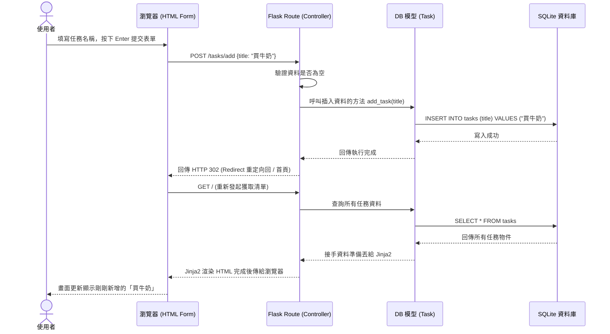

# 流程圖設計 (FLOWCHART) - 任務管理系統

## 1. 使用者流程圖 (User Flow)
這張流程圖展示了使用者開啟任務管理系統後，可以進行的各項動作以及體驗上的操作路徑。

```mermaid
flowchart LR
    A([使用者開啟網頁]) --> B[首頁 - 任務清單]
    B --> C{要執行什麼操作？}
    
    C -->|新增任務| D[在輸入框填寫任務名稱]
    D --> E[點擊「新增」按鈕表單送出]
    E --> F([系統處理後重新渲染首頁])
    
    C -->|完成任務| G[點擊特定任務旁的「完成」按鈕]
    G --> F
    
    C -->|刪除任務| H[點擊特定任務的「刪除」按鈕]
    H --> F
    
    C -->|編輯任務| I[點擊任務欄位的「編輯」按鈕]
    I --> J[跳轉至編輯頁面 (或在原畫面變成輸入框)]
    J --> K[修改內容後儲存]
    K --> F
```

## 2. 系統序列圖 (Sequence Diagram)
本圖以「**使用者新增任務**」為核心，展示了從前台的表單輸入，經由路由分配一直到資料寫入 SQLite 的整體資料往返 (Data Flow) 流程。



## 3. 功能清單對照表

本表格清晰對應每一個介面所操作的後端 API 與請求方式，方便開發者接下來實作撰寫 Route 邏輯。

| 任務/功能 | URL 路徑 | HTTP 方法 | 詳細說明 |
| -------- | -------- | --------- | -------- |
| **瀏覽首頁清單** | `/` | `GET` | 讀取資料庫中所有任務，並透過 Jinja2 將任務清單渲染至 HTML 畫面。 |
| **新增一筆任務** | `/tasks/add` | `POST` | 接收表單傳入的字串，驗證後寫入資料庫。透過 POST 防止透過網址列被意外觸發。 |
| **標記任務完成** | `/tasks/complete/<id>` | `POST` | 把指定 ID 的任務從待辦變為已完成(或是做為狀態切換 Toggle)。 |
| **刪除任務** | `/tasks/delete/<id>` | `POST` | 將指定 ID 的任務永久由資料表刪除。 |
| **編輯指定任務** | `/tasks/edit/<id>` | `GET` / `POST` | `GET` 負責渲染顯示修改專用的畫面，`POST` 接收新參數來更新資料本身。 |
